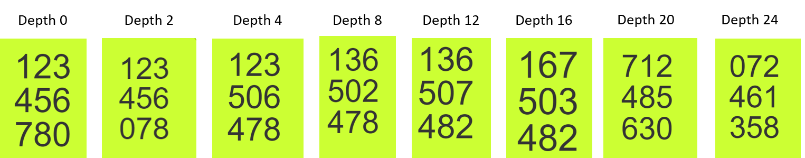
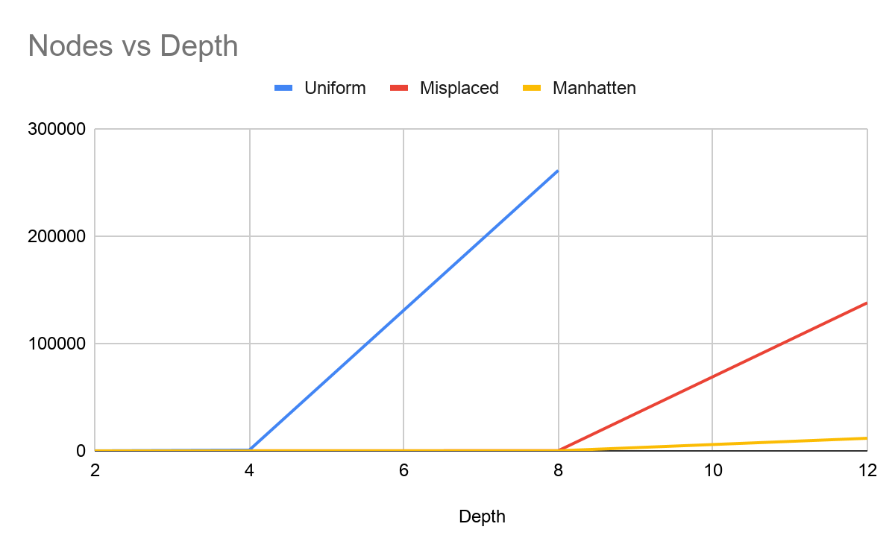
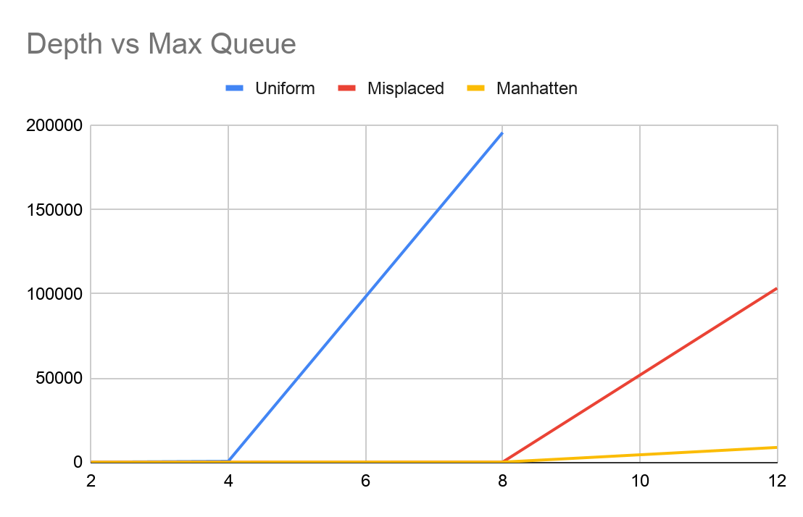

Assignment 1 					      CS170: Introduction to Artificial Intelligence	

Boi-Hien Huang								Dr. Eamonn Keogh

862012798

bhutan019@ucr.edu

2-15-2021

In order to complete this assignment, I consulted the following sources. 

* https://stackoverflow.com/questions/19770087/can-somebody-explain-in-manhattan-dstance-for-the-8-puzzle-in-java-for-me

* https://www.geeksforgeeks.org/stl-priority-queue-for-structure-or-class/

* https://en.cppreference.com/w/cpp/utility/tuple

* https://www.geeksforgeeks.org/tuples-in-c/

* https://stackoverflow.com/questions/64788932/how-to-make-a-min-heap-of-tuples-sorted-by-the-2nd-element

I used this source to learn how the manhattan distance was solved

I used the second source to set up a compare struct for my priority queue and make the min value at the top of my queue

I used the third and fourth and fifth link in order to store different variable types together in tuples and how to access them

**CS 170 8-Puzzle Solver**

**Introduction**

The 8-Puzzle is a game where the goal is to place the 8 tiles in sequential order. The initial state of the board can be in any random order and the program will solve it using a goal state. In order to make moves in the game, there is a blank tile that can be swapped with other tiles. Once the blank tile is at the bottom right of the grid and the other numbers are in order, the goal state is reached. 

This is a report on my findings of the different search algorithms that we learned about in our online class. We used the uniform cost search, the manhattan distance heuristic, and the misplaced tiles heuristic to solve the puzzle. Our report will consist of explaining how many nodes were expanded for each algorithm and what their max queue sizes were.

**Uniform Cost**

According to our project specs sheet, the uniform cost search expands the node that is cheapest. We set the heuristic value to 0 because in this case, it is an A star with the h(n) value hardcoded. This algorithm will probably take the longest since it expands every child node. 

**Misplaced Tile Heuristic**

Misplaced tile heuristic is where we traverse the 2d vector and add up all of the tiles that are out of order. We then assign this sum total to the h(n) value that tells us how many steps we are away from the goal state. This method will probably be faster compared to uniform since it considers the smallest heuristic value. 

**Manhattan Distance Heuristic**

According to our lecture, the Manhattan distance heuristic is where we assume  each incorrect tile can be magically placed into the correct position. We then add up the total amount of moves it would take for the tile to get to the goal position and assign it to our h(n) value. We then repeat for einach tile that is not in order. 

**Example with Graphs**

In Figure 1, the test cases that Dr. Keogh provided for us is displayed. We used these in order to test our program against various puzzle depths and analyzed them. 

Figure 1: Test cases for solution depths that were provided by Dr. Keogh

After collecting the results, we found that the 3 different searches had similar outputs when the solution depth was smaller. However, with more depth, the heuristic searches showed they were more efficient. In figure 2, the misplaced and manhattan beat out the uniform searches by a lot. This is because the heuristic values allow the misplaced and manhattan to search fewer nodes than the uniform. The result is even more evident with more depth because it timed out at depth 12. 

Figure 2: node vs depth chart for test cases with depth 2, 4, 8, 12

In figure 3, we analyze the maximum number of nodes that are in the priority queue. We can come to the conclusion that the heuristic searches are more efficient since the maximum number of nodes was less than in the uniform searches. Since the number of nodes to search are less, the number of nodes in the queue at a time are less. 

Figure 3: Depth vs Max Queue graph with depths of 2, 4, 8, and 12

**Conclusion**

Analyzing the three search methods, we can come to the conclusion that the most efficient ones are in the order of manhattan, misplaced, and uniform. Since uniform is simply a breadth first search that sets the heuristic to 0, it will expand every node with the same cost. Although misplaced and manhattan are more efficient than uniform, the manhattan search seems to outperform the misplaced. Manhattan automatically assigns the incorrect tile to the correct position and counts the number of steps. In the final analysis, the manhattan A* is the most efficient. 

**Traceback**

This is traceback of depth 4

Expanding State

1 2 3

5 0 6

4 7 8

reached here2

The best state to expand with a g(n) =  1 and h(n) = 3 is

1 2 3

0 5 6

4 7 8

reached here2

The best state to expand with a g(n) =  2 and h(n) = 2 is

1 2 3

4 5 6

0 7 8

reached here2

The best state to expand with a g(n) =  3 and h(n) = 1 is

1 2 3

4 5 6

7 0 8

reached here2

The best state to expand with a g(n) =  4 and h(n) = 0 is

1 2 3

4 5 6

7 8 0

Goal state!

1 2 3

4 5 6

7 8 0

expanded a total of 16

max number of nodes in queue was 13

depth of goal was 4

This is traceback of depth 12

… 

… 

… 

reached here2

The best state to expand with a g(n) =  11 and h(n) = 1 is

1 2 3

4 5 6

7 0 8

reached here2

The best state to expand with a g(n) =  12 and h(n) = 0 is

1 2 3

4 5 6

7 8 0

Goal state!

1 2 3

4 5 6

7 8 0

expanded a total of 11720

max number of nodes in queue was 8791

depth of goal was 12

**GitHub**

https://github.com/boihien/8puzzle.git
